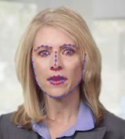

Face recognition using facial feature points
=====

This project aims to detect and track faces and facial features and using them, recognize faces on still images and videos.

## Description
This project is very useful and well designed for the users to recognize the faces.
Using the web camera, the project will capture images at real time. To enroll a subject, the user is usually only required to click a subject’s face and enter the name. Then, the face data will be stored in database.
After enrollment, whenever anyone appears in front of the web camera, the project will recognize who the person is. If his face is already enrolled, then the name of recognized person will be printed on the screen and if not, “unknown” string will be printed. 
In addition, this project also provides the finding facial feature points and display them on a face image. These facial feature points include eyes, eyebrows, nose, mouth and face contour, total of 68 points.
This also includes some basic performance tweaks to make things run a lot faster.

    
  
Recognizing face

    
  
Detecting facial feature points

## Technical Specifications
This project has the following technical specifications.
* Face Detection
  * Robust frontal face detection
  * Detection of multiple faces in an image
* Facial Feature Detection
  * Detection of 68 facial feature points including eyes, eyebrows, mouth, nose, face contour
* Face Matching
  * Convert facial features to facial encodings
  * Matching of two faces by comparing with facial encodings
